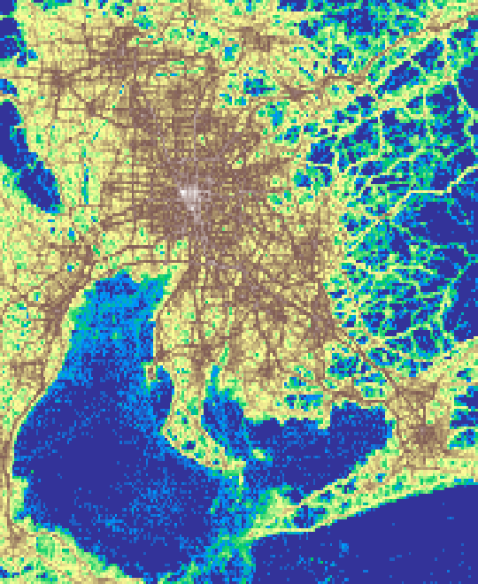

# Reverse-engineering the observation area of the 'YJMob100K' data

## Usage

The [`pyproject.toml`](pyproject.toml) document the required dependencies. It's suggested to use the [Poetry](https://python-poetry.org/) packaging tool. In this case, just issue the `poetry install` command to set up a virtual environment with all the necessary dependencies.

After the development environment has set up, run the notebooks in the following order to reproduce the results.

1. [plot_heatmaps.ipynb](src/plot_heatmaps.ipynb)
    - this will reproduce the heatmaps [Figure 6] from the [data description paper](https://arxiv.org/abs/2307.03401),
    - do the inverse-transformed plots, and
    - some related plots for the paper
2. [generate_grid.ipnyb](src/generate_grid.ipynb)
   - this will locate the observation area within Japan and generate the grid

These two notebooks contain the main work. The [detect_homes.ipynb](src/detect_homes.ipynb), [validate_home_detection.ipynb](src/validate_home_detection.ipynb), [calculate_grid_complexity.ipynb](src/calculate_grid_complexity.ipynb), and the [src/plot_grid.ipynb](src/plot_grid.ipynb) are optional steps to reproduce the figure in the technical validation section of the paper.

### Upscaling grid

- [Upscale heatmap as a template](scale_grid.ipynb)
    - merges the neighboring cells while summing the activity in the four cells resulting lower resolution template heatmaps
- [Locate upscaled observation area](locate_rescaled_observation_area.ipynb)
    - plots the land area of the selected six prefectures proportionally to the upscaled heatmap (grid) and applies template matching

### Other cities

1. [Helsinki](src/helsinki.ipynb)
    - the Helsinki notebook processes the data for different grid sizes in one run
2. [London](src/london.ipynb)
    - `rx` and `ry` parameters are for the grid size, use either 500, 1000, 2000, or 4000
3. [Toronto](src/london.ipynb)
    - it is the same notebook as for London, because the dataset is the same
    - enable the Toronto parameter block
4. [Dallas--Fort Worth](src/dallas.ipynb)
    - `RES` parameter is for the H3 resolution, vales between 6 and 10 were applied

### User identifiability

A user is considered k-identifiable if the most frequently visited k location are distinguishable [^zang2011anonymization].
The top four location have been determined for every user, then the grid cell were upscaled to 1, 2, 4, 8, and 16 km.

The following table compares the top-four-location identifiable users by upscaled grids.
The relevant notebook is [here](src/top_cell_identifiability.ipynb).

|   distinguishable cells |   1 km x 1 km |   2 km x 2 km |   4 km x 4 km |   8 km x 8 km |   16 km x 16 km |
|------------------------:|--------------:|--------------:|--------------:|--------------:|----------------:|
|                       4 |         35469 |         12882 |          5090 |          1810 |             470 |
|                       3 |         48228 |         42323 |         28457 |         16752 |            7438 |
|                       2 |         15582 |         38548 |         50987 |         52608 |           44939 |
|                       1 |           721 |          6247 |         15466 |         28830 |           47153 |

[^zang2011anonymization]: Hui Zang and Jean Bolot. 2011. Anonymization of location data does not work: a large-scale measurement study. In Proceedings of the 17th annual international conference on Mobile computing and networking (MobiCom '11). Association for Computing Machinery, New York, NY, USA, 145–156. https://doi.org/10.1145/2030613.2030630

## Results

The results are included to be available without executing the code.
Most notably, the [reproduced grid](output/grid_bl_2449.geojson) (in [EPSG:2449](https://spatialreference.org/ref/epsg/2449/) projection).

### Choropleth maps using the reproduced grid

The spatial distribution of the activity (first) and the number of unique users (second) per cell using the reproduced grid.

<!-- ## Citation

Use the following BibTeX entry to cite the paper.

  
BibTeX

  <pre>

  </pre>

The code can be cited via [GitHub](https://github.com/pintergreg/reverse-engineering-YJMob100K-grid). -->

## Data sources

1. Mobility data: [YJMob100K](https://zenodo.org/records/10836269)
    - [details](data/yjmob100k/README.md) about how to prepare it
2. OpenStreetMap data
    - Copyrighted by OpenStreetMap contributors. It is available under the Open Database License (ODbL).
    - Administrative data is from OpenStreetMap
        - downloaded from [OSM-Boundaries](https://osm-boundaries.com/)
            - prefectures (admin level 4), then filtered manually
            - municipalities (admin level 7), then filtered manually
            - wards (admin level 8), then filtered to Nagoya
    - Coastline is downloaded from https://osmdata.openstreetmap.de/data/land-polygons.html
        - the islands of Japan was extracted using the prefecture boundaries
4. Census data
    - The [Population Census 2020, Population, Households, Sex, Age and Marital status, Table 1-1](https://www.e-stat.go.jp/en/stat-search/files?page=1&layout=datalist&toukei=00200521&tstat=000001136464&cycle=0&year=20200&month=24101210&tclass1=000001136466) was downloaded from the
     Portal Site of Official Statistics of Japan website (https://www.e-stat.go.jp/)

## License

- The code is licensed under [BSD-3-Clause](LICENSE)
- The documentation and figures are [CC BY 4.0](https://creativecommons.org/licenses/by/4.0/)
- The shape files are from OpenStreetMap and licensed under the Open Data Commons Open Database License ([ODbL](https://opendatacommons.org/licenses/odbl/1-0/))
- The census data was downloaded from the Portal Site of Official Statistics of Japan website (https://www.e-stat.go.jp/)
